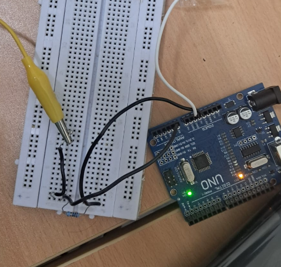
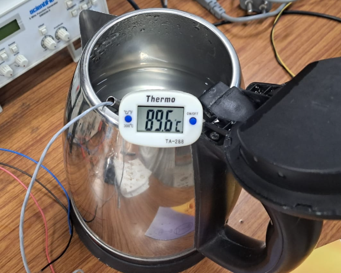
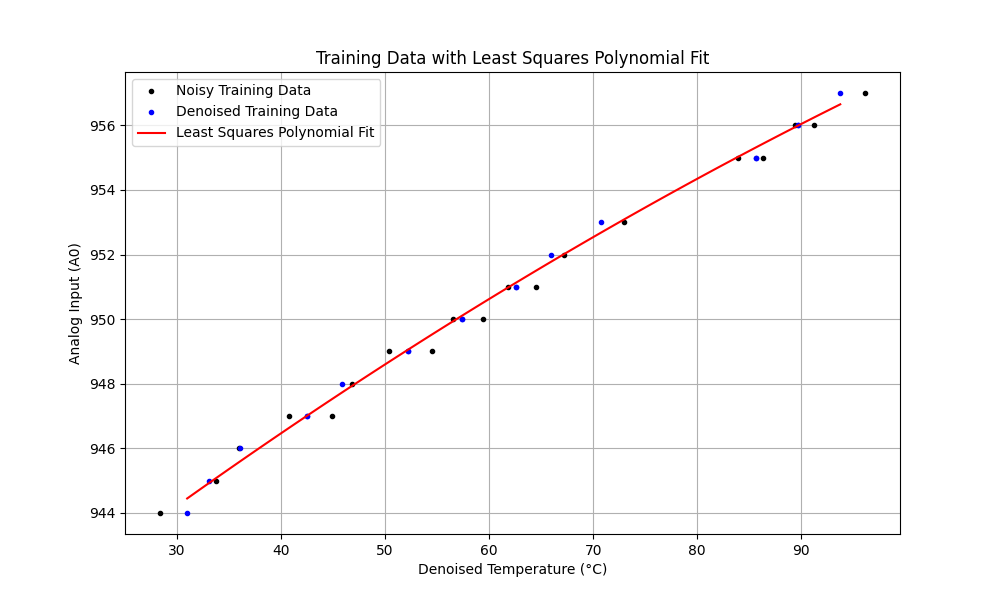
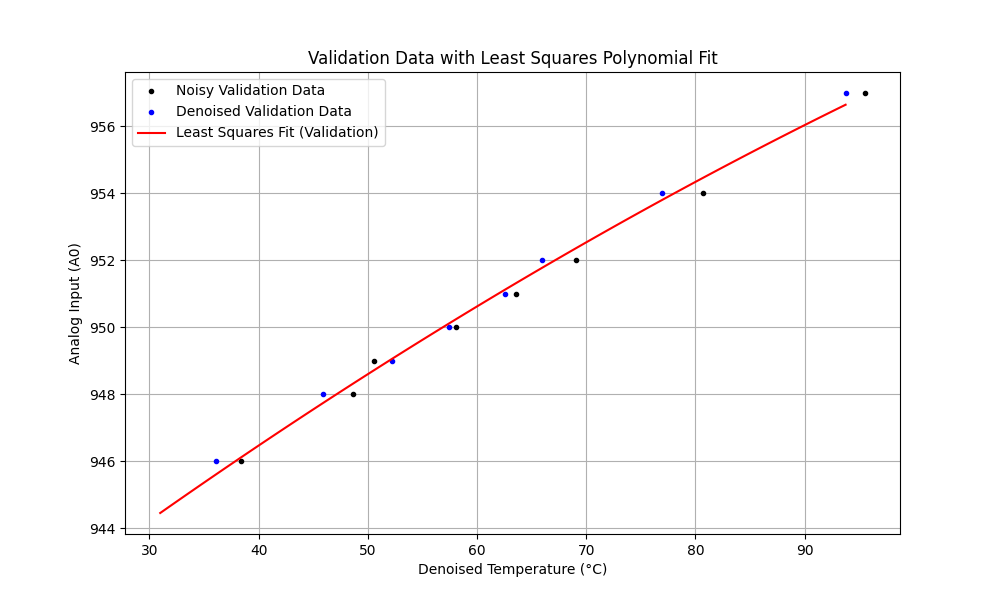

# Voltage-Temperature Calibration of PT-100 RTD using the Callendar-Van Dusen Equation and Noise Reduction using Random Forest Regression

## EE1030: Matrix Theory  
Indian Institute of Technology Hyderabad  

### Author  
Yellanki Siddhanth  
(EE24BTECH11059)

---

## Objective
This experiment uses the Callendar-Van Dusen equation and the least squares method to model the relationship between temperature and voltage for a PT-100 RTD (Resistance Temperature Detector). The objective is to derive a polynomial calibration model that relates voltage output from the RTD to temperature, utilizing additional methods for improved fitting accuracy.

## Procedure
1. **Circuit Construction**: A circuit (Figure 1) was built on a breadboard to connect the PT-100 RTD sensor with the Arduino. The setup included necessary components, such as resistors and a Wheatstone bridge, for accurate voltage measurement.

2. **Temperature Measurement**: To validate the readings from the PT-100 RTD, an alcohol thermometer (Figure 2) was used to measure the ambient temperature. Since reading can be difficult with an alcohol thermometer, a digital thermometer (Figure 3) is a good alternative for reliable reference comparison with the voltage output from the RTD sensor.

3. **Data Collection**: The output voltages from the PT-100 RTD sensor were recorded at known temperature points using the Arduino, while simultaneously measuring the temperature with the alcohol thermometer.
   - **Data Note**: For a more accurate plot, analog readings from the PT-100 RTD sensor were used instead of voltage readings, allowing for greater precision in calibration. The relationship between voltage and analog readings is defined by \( V = k \times \text{Analog Readings} \), where \( k \) is a constant specific to the setup, which in the case of an Arduino is \( \frac{5}{1023} \).

---

## Figures
### Circuit for the PT-100 RTD setup

  
### Schematic Circuit Diagram to Measure the Output of PT-100

### Temperature measuring setup
- **Alcohol Thermometer**  
  
  
- **Digital Thermometer**  
  

---

## Training Data
The training data collected by the PT-100 RTD sensor, as measured by an Arduino, are presented in Tables 1 and 2. This data will be used to fit the Callendar-Van Dusen model to describe the voltage-temperature relationship.

### Table 1: Training Data for PT-100 Calibration

| Temperature (°C) | Analog Input (A0) |
|------------------|-------------------|
| 73.0             | 953               |
| 46.8             | 948               |
| ...              | ...               |

### Table 2: Denoised Training Data for PT-100 Calibration

| Denoised Temperature (°C) | Analog Input (A0) |
|---------------------------|-------------------|
| 70.72531286               | 953               |
| 45.85104667               | 948               |
| ...                       | ...               |

---

## Results from Least Squares Method
The regression yielded the following model:
\[
V(T) = V(0) \left( 1 + AT + BT^2 \right)
\]

with coefficients:
- \( V(0) \approx 4.5789 \)
- \( A \approx 0.000280 \)
- \( B \approx -5.814 \times 10^{-7} \)

---

## Random Forest Regressor
To improve the fit of the polynomial model, a Random Forest Regressor was employed. This ensemble learning method constructs multiple decision trees during training and outputs the mean prediction of individual trees.

1. **Training**: The training data was used to fit the Random Forest model, which captures complex relationships between the input features (temperature) and the target variable (voltage).
2. **Prediction**: The Random Forest model provides a flexible approach, accommodating non-linear relationships without requiring explicit polynomial terms.

The predicted voltage values (Table 2) from the Random Forest model were then compared against the measured voltages, demonstrating improved accuracy in fitting.

---

## Validation
To validate the models, additional temperature points were used. The measured voltage values were compared to those predicted by the models, as shown in Tables 3 and 4.

### Table 3: Measured Validation Data

| Temperature (°C) | Analog Input (A0) |
|------------------|-------------------|
| 69.1             | 952               |
| 80.7             | 954               |
| ...              | ...               |

### Table 4: Denoised Validation Data

| Denoised Temperature (°C) | Analog Input (A0) |
|---------------------------|-------------------|
| 65.92970619               | 952               |
| 76.95450857               | 954               |
| ...                       | ...               |

---

## Conclusion
The derived models accurately capture the relationship between voltage and temperature for the PT-100 RTD, allowing the Arduino to estimate temperature from voltage measurements over the calibrated range. The Random Forest Regressor provided improved fits, demonstrating its utility alongside traditional least squares methods.

## Code
The calibration and regression processes were controlled using the C++ source file `codes/data.cpp`, which was uploaded to the Arduino using PlatformIO. The Random Forest regression was implemented using the `scikit-learn` library in Python, which provides an efficient way to fit ensemble learning models and improve prediction accuracy. The plotting and least square computation Python file can be referred to in `codes/lsqn.py`.
